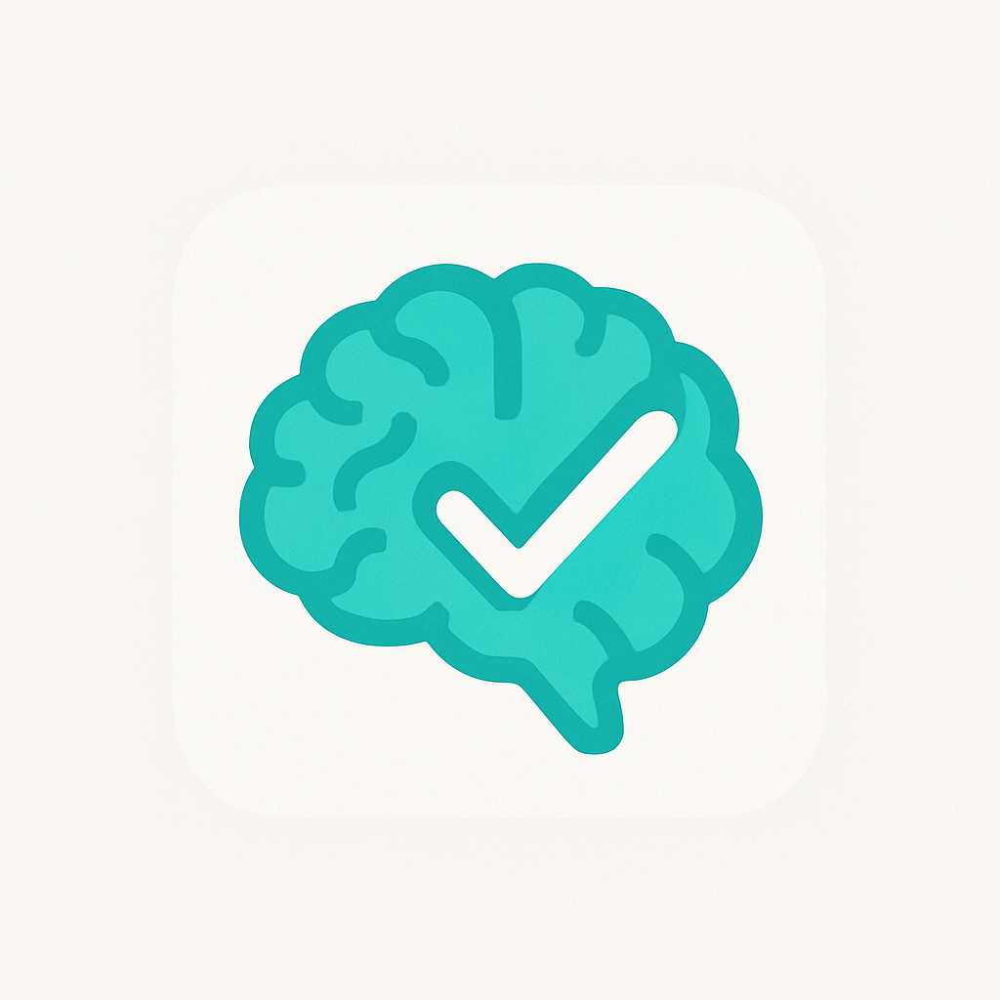
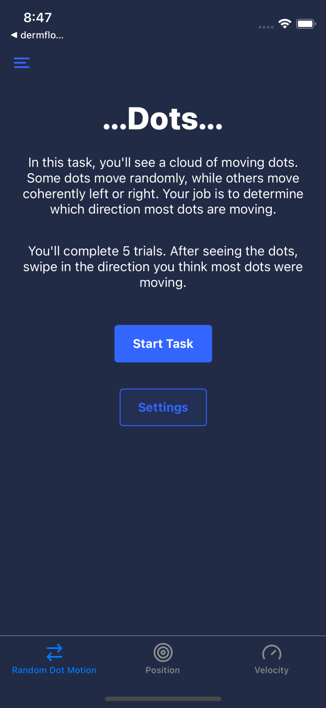
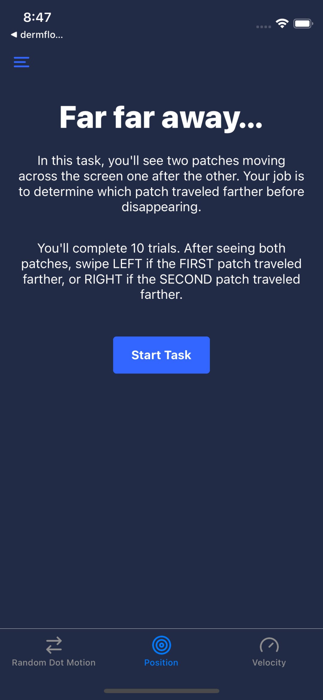
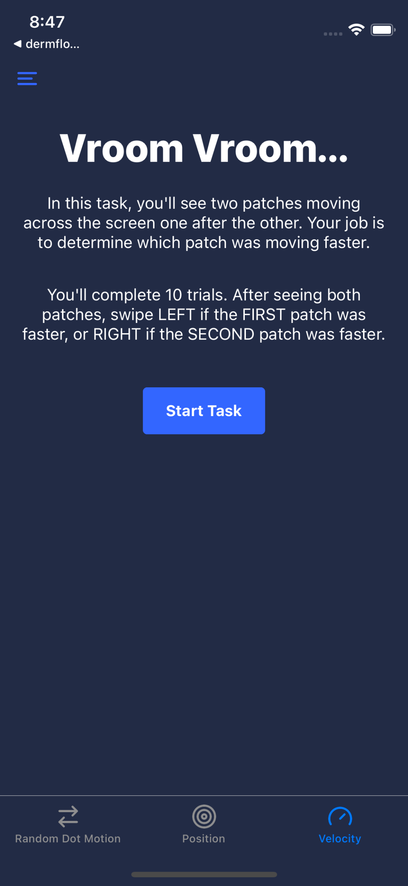
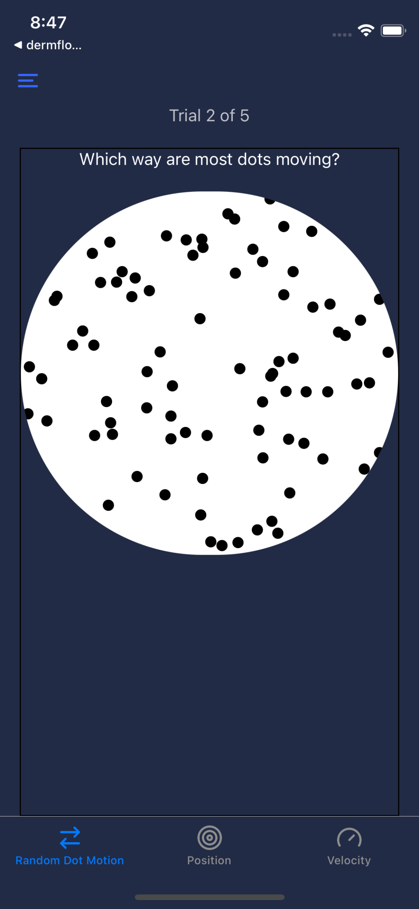
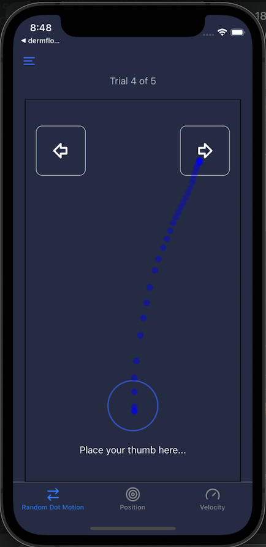

# MindYourTask

## App Overview

**Background:** The research field of `decision-making and learning` in Humans typically uses experimentation performed in a closed-room setting, generally at the team/lab's office, on a monitor/PC.
These experiments typically consist of some stimuli presented on the screen to the subject, requiring them to perform an action in response to the stimuli. 
Optionally, a feedback follows to the subject's response. Depending on the research question, this process repeats for multiple `trials` in a `session` and possibly across multiple `sessions`.
Most importantly, this way of experimentation requires the subject to turn up in-person to the site of experimentation and spend uninterrupted time performing the experiment.

**Purpose:** *MindYourTask* is a mobile app, particularly focussing on 3 specific tasks in the field of `perceptual decision-making`.
The notable aspects of *MindYourTask*, in contrast with the traditional experimentation, are:

    - Native Mobile App (iOS/Android) on Subject's personal devices
    - Experiment tasks will be adapted such that they will be performed in shorter timescales (couple of minutes), multiple times a day, across multiple days
    - Subjects choose to open the app and perform the tasks whenever they please - in certain time windows (for e.g: once in the morning, once in the afternoon and once in the evening)
    - Responses/Choices such as `Left` and `Right`, which would normally be presented as buttons on a screen to be clicked, would be recording by swipes on the mobile screen

**Target Audience:** General Public - for reasonable uniformity, university students, working professionals of an age group window (say 18-40 ?)

**Platform:** Developed in `react-native` built for `iOS` and `android`

## Core Features

**Main Tasks:** Currently, there are 3 tasks in the app. All of them share certain components:
 - Task Welcome Screen - when this task is selected from the **Home Screen**. \
 - Session begins with repeated Trials. Each Trial contains:
    - Preparatory/ Resting Period
    - Stimulus/Stimuli Presentation (see examples) -- *differs by task*
    - User Response
    - Feedback
 - Task Conclude / Thanks screen

**Task Flow:** 

 - Once the user has the app on their device, on any given instance they open the app, they need to see **Home Screen**
 - Upon choosing one of the ongoing Tasks, that particular **Task Screen** opens.
 - When the user completes this particular session of the chosen task, then they go back to **Home Screen** to choose another Task.

**Additional Features:**

 - Splash Screen (generally only Logo) 
 - Welcome Screen, upon first time App Open, mostly App Name and Brief description of the purpose
 - Introductory Screen (a bit more information, can be a couple of screens if nice illustrations)
 - Information Screen (a bit of practical information, where they can find more of this information inside the app, like Settings) 
 - Data Privacy Statement Screen
 - Informed Consent Screen (here they would be reading important disclaimers and that they consent for the experiments, data etc.). It involves some "Accept" kind of buttons.

**Home Screen:** This could be the most important screen since everytime user opens the app, this is shown. Overall, it has the following important functions:

 - Displaying different tasks as icons or tiles etc
 - Some kind of information display on the current status of - whether a task is running, or completed, or disabled because it is just completed, how many times it was completed etc. Nothing is mandatory, but some kind of such information. At the least, say a green tick if it is completed and graying out for disabling. 
 - Navigating to different tasks - the icons above being clicakble, so must look like clickables
 - [Optional] Link to Leaderboard 
 - Link to Settings/Help/Contact etc

## Design Guidelines

**Style Preferences:** Colors, typography, icon style - up to designer's discretion. Only thing to keep in mind is the audience is younger population of students and professionals.

**Branding:** Logo (will give a reference), app name (for now *MindYourTask* )

## Interactions & Animations

Transitions: Most of the screen transitions can be basic, sliding from the sides.

**Swipes** One of the most common features of the app is in `User Response` part of the Task Screens. User swipes from the bottom center of the screen to either the `top right` or `top left` of the screen. And the swipe trajectory needs to be displayed from the initial touch point to the ending touch point. 

Alerts: In many screens, there could some alerts shown to user for instance:
    - **positive** ones where task is successfully completed
    - **warning** ones where task failed or an option is unavailable. For e.g, if the user did not complete the swipe properly. 

## For Reference

The following are the existing resources. They are not expected to be followed in terms of design but are only to give an idea.

**Logo**

**Some Screenshots**

